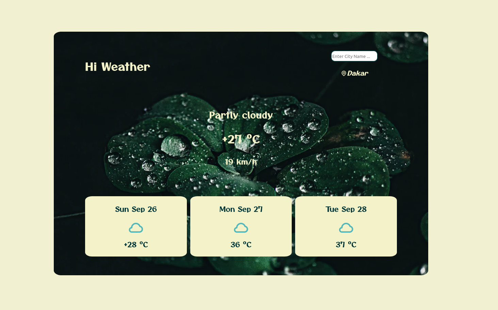

# Weather App

## Welcome! 👋

- Live Site URL: [Here](https://saliou1920.github.io/weather-app/)

## Table of contents 🙂

- [Overview](#overview)
  - [Screenshot](#screenshot)
  - [Built with](#built-with)
- [Author](#author)

**Note: Delete this note and update the table of contents based on what sections you keep.**

## Overview

This is a simple weather app built using goweather API.

### Screenshot 💻

  

### Built with 🧰

- Semantic HTML5 markup
- CSS custom properties
- Javascript
- Goweather API

## Author

- Linkedin - [@Saliou](https://www.linkedin.com/in/saliou-diop-527741112/)
